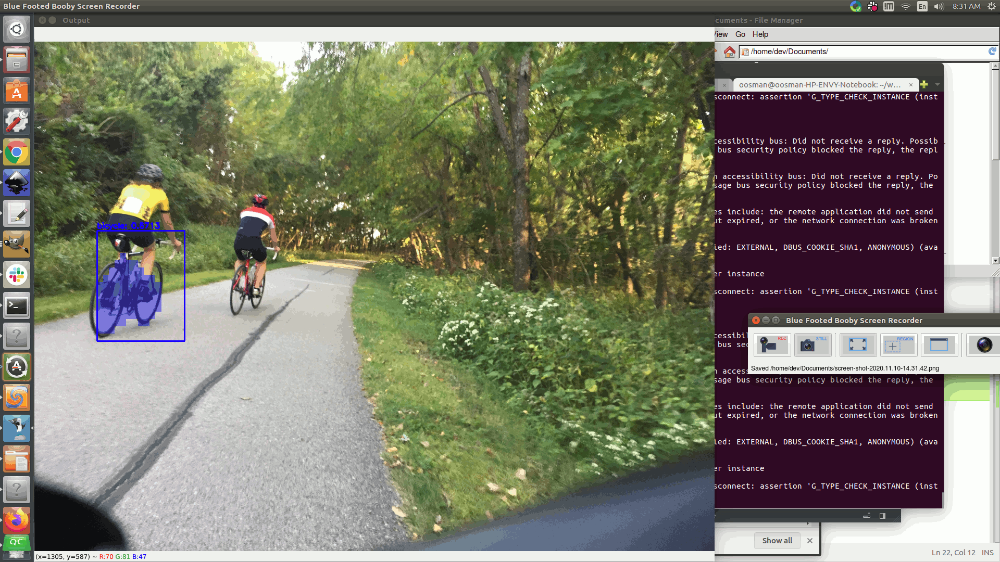

# maskr-cnn
based on Adrian rosebrock's project - https://www.pyimagesearch.com/2018/11/19/mask-r-cnn-with-opencv/

### Requirement

Build and install the leila.docker image. Then run it:

```bash
./enterdocker.sh
```
password is dev

### Usage
```bash
python mask_rcnn.py --mask-rcnn mask-rcnn-coco --image images/IMG_8634b.JPG
```



